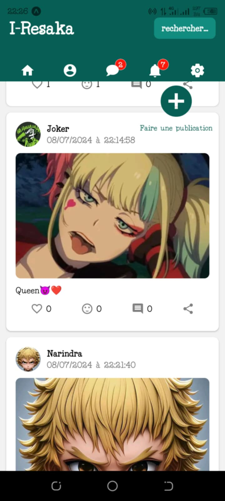
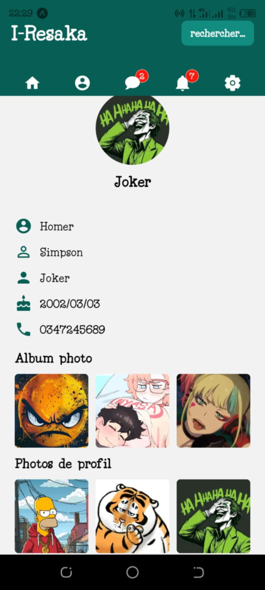

<h1 align="center" style="color: green; font-family: 'Arial', sans-serif; text-shadow: 2px 2px 4px rgba(0, 0, 0, 0.1); margin-top: 50px;">
🙋‍♂️ Bienvenue à vous étranger 😸
</h1>

  

<h2 align="center">En tant que développeur passionné par les technologies, je me spécialise dans le développement d'applications web, mobiles et divers utilitaires.</h2>

## 🔧 Technologies & Outils🔧

  
  
  
  
  
  
  
  
  
  
  

## 🎨 Un exemple de mes projets  
  <h5 align="center">  Un Mini réseau sociaux faites avec React Native Expo 📱 et  Firebase database 📥 </h5>

- [Mini réseau sociaux](https://github.com/Narindrakoko/Mini_reseau_sociaux)

  
  
  

## 📫 Comment me contacter

-  [heriniainanarindra25@gmail.com](mailto:heriniainanarindra25@gmail.com)
-  [Narindra-Heriniaina](https://www.linkedin.com/in/narindra-heriniaina)

